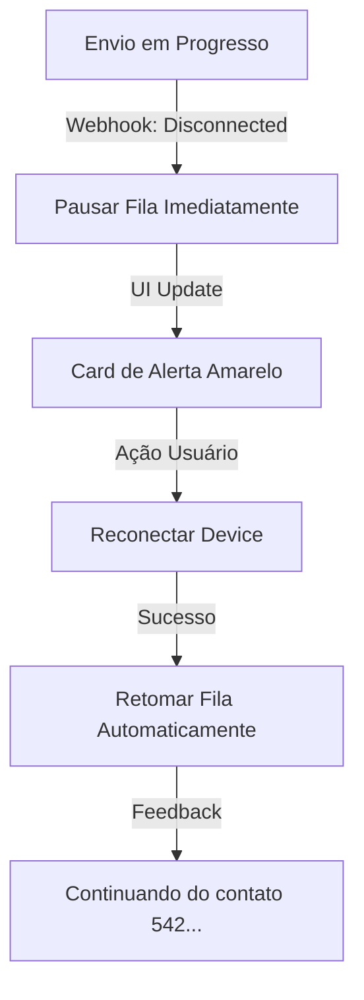

# UX Design Specification a inove-ai-zap

**Author:** Joel
**Date:** 2026-01-14

---

<!-- UX design content will be appended sequentially through collaborative workflow steps -->

## Executive Summary

### Project Vision
O **inove-ai-zap** é uma ferramenta de automação de marketing via WhatsApp desenhada para remover barreiras técnicas para MEIs e pequenas empresas. Diferente de CRMs complexos, nossa filosofia é **"Simplicidade Radical e Confiança Operacional"**. O sistema oferece uma experiência "Fire and Forget" (Agendar e Esquecer), onde o usuário realiza ações simples (importar, segmentar, compor) e o sistema assume a complexidade técnica e de segurança (filas, delays, anti-ban) de forma transparente.

### Target Users

#### 1. Carlos (O Empreendedor Faz-Tudo)
- **Perfil:** Dono de negócio (ex: corretor, lojista), 45+ anos.
- **Contexto:** Usa WhatsApp para tudo. Tem planilhas de clientes mas não tem tempo de contatar um por um.
- **Dor:** Medo de ferramentas complicadas e de perder o número por banimento.
- **Necessidade UX:** "Botão mágico". Quer importar a planilha, escrever a mensagem e voltar ao trabalho. Zero tolerância para configurações técnicas (APIs, JSON).

#### 2. Juliana (A Secretária Multitarefa)
- **Perfil:** Operacional (recepção, administrativo), 25-35 anos.
- **Contexto:** Interrompida constantemente. Internet instável, computador compartilhado.
- **Dor:** Processos que quebram se ela fechar a aba ou se a internet cair.
- **Necessidade UX:** Resiliência. Feedback claro se algo deu errado (ex: "WhatsApp desconectou") e capacidade de retomar o trabalho sem perder nada.

### Key Design Challenges

1.  **Simplicidade vs. Segurança (Anti-Ban):** Como impor limites rígidos de envio (delays, pausas) sem frustrar o usuário com lentidão aparente? A UX precisa transformar a "lentidão" do envio seguro em uma feature de "proteção e cuidado".
2.  **Abstração Técnica:** O sistema usa conceitos complexos no backend (Webhooks, filas, conexão com UAZAPI via QR Code). O desafio é esconder toda essa "canalização" atrás de interfaces humanizadas (ex: "Conectando ao seu celular..." em vez de "Aguardando Webhook de Auth").
3.  **Gestão de Erros Transparente:** Falhas de conexão são inevitáveis no WhatsApp. A UI precisa guiar a recuperação (reconectar QR Code) sem pânico, mostrando exatamente o que foi salvo e o que falta enviar.

### Design Opportunities

1.  **Importação "Mágica":** Transformar o momento chato de upload de CSV em uma experiência gratificante de "limpeza e organização", mostrando quantos contatos foram sanitizados/salvos.
2.  **Composer com "Assistência Invisível":** Um editor de mensagens que sugere variações (Spintax) de forma visual, educando o usuário sobre boas práticas de anti-spam enquanto ele escreve, sem parecer um manual técnico.
3.  **Dashboard de "Paz de Espírito":** Uma tela de acompanhamento que não mostre apenas números técnicos, mas reforce a sensação de que "o robô está trabalhando por você", permitindo que o usuário se desconecte mentalmente da tarefa.

## Core User Experience

### Defining Experience
A interação mais crítica é o **"Ciclo de Confiança"**: O usuário agenda o envio (Input) e recebe a garantia visual de que o sistema assumiu o controle (Feedback).
O fluxo deve ser: **Importar (Drag & Drop) -> Validar (Sanitização) -> Disparar (Agendamento Seguro)**.
Se o usuário hesitar em qualquer uma dessas etapas por medo técnico, a promessa de valor do produto falha.

### Platform Strategy
*   **Plataforma Principal:** **Web Desktop (Chrome/Edge)**. O cenário de uso envolve manipulação de arquivos (Excel/CSV) e digitação de copys de vendas, fluxos que ocorrem primordialmente no computador.
*   **Mobile (Secundário - Web Responsive):** Focado apenas em monitoramento (ver barra de progresso) e manutenção rápida (reconectar QR Code). Não otimizaremos fluxos complexos de setup ou importação para mobile no MVP.
*   **Requisito Crítico:** O app deve funcionar de forma desacoplada. A UI deve educar explicitamente o usuário de que ele pode fechar a aba/janela após o agendamento ("Fire and Forget").

### Effortless Interactions
1.  **Sanitização de Contatos:** O usuário faz upload de uma planilha "suja" (com parênteses, traços, sem DDD, colunas misturadas) e o sistema devolve uma lista limpa e pronta instantaneamente. Zero configuração manual de colunas.
2.  **Delay Transparente:** O sistema não pergunta "quantos segundos de delay?". Ele afirma: *"Aplicando intervalo de segurança inteligente para proteger seu número."* O esforço cognitivo de configurar o anti-ban é removido.

### Critical Success Moments
1.  **O "Check" de Validação:** Quando o sistema diz *"Lemos 1.500 contatos. 1.480 válidos e prontos."* (Alívio imediato e sensação de organização).
2.  **A Primeira Mensagem Enviada:** Ver a barra de progresso mover de 0% para 1% enquanto o usuário realiza outra tarefa. (Construção de Confiança).
3.  **Recuperação de Crash:** Se a internet cair, o sistema mostrar um alerta calmo e, ao voltar, retomar do contato exato onde parou. (Redução de Pânico).

### Experience Principles
1.  **Guie, Não Pergunte:** O sistema toma decisões de segurança (delays, pausas) pelo usuário, em vez de oferecer opções complexas.
2.  **Feedback Humano & Natural:** Use linguagem natural ("O robô está descansando...") em vez de técnica ("Worker Idle: 4000ms").
3.  **Falha Graciosa:** Erros de conexão são tratados como pausas temporárias, nunca como falhas fatais ou perda de dados.

## Desired Emotional Response

### Primary Emotional Goals
1.  **Alívio (Relief):** "Ufa, não preciso fazer isso manualmente 2.000 vezes." A sensação de tirar um peso das costas.
2.  **Segurança (Peace of Mind):** "O sistema está cuidando do meu número. Não vou ser banido." A substituição do medo pela confiança técnica.
3.  **Controle (Empowerment):** "Eu consigo fazer isso sozinho, sem chamar o 'cara da TI'." Sensação de competência.

### Emotional Journey Mapping
*   **Descoberta/Login:** *Curiosidade Cautelosa.* ("Será que é difícil?"). A UI deve ser limpa e acolhedora para desarmar a ansiedade.
*   **Importação:** *Satisfação.* Ver a bagunça se organizando automaticamente. ("Nossa, foi rápido!").
*   **Agendamento/Disparo:** *Confiança.* O feedback visual do sistema ("Iniciando envio seguro...") deve firmar o compromisso.
*   **Pós-Envio (Fire and Forget):** *Liberdade.* Fechar o computador sabendo que o trabalho continua.

### Micro-Emotions
*   **Trust vs. Anxiety:** Cada loading bar, cada mensagem de "salvo", cada status "conectado" deve combater a ansiedade inerente de lidar com disparos em massa.
*   **Delight (Encantamento):** Pequenos toques, como uma animação suave ao concluir um envio ou uma mensagem amigável ("Bom trabalho, Carlos!") ao terminar.

### Design Implications
*   **Cores:** Tons de **Verde (Sucesso/Segurança)** e **Azul (Tecnologia/Confiança)** predominantes. Evitar vermelhos alarmantes, exceto para erros críticos que exigem ação imediata.
*   **Copywriting:** Uso de voz ativa e tranquilizadora.
    *   *Ruim:* "Erro 500: Falha no Webhook."
    *   *Bom:* "Pausa para segurança: Reconecte seu WhatsApp para continuar."
*   **Feedback Visual:** Nunca deixe a tela estática durante processos longos. O "pulso" da aplicação mostra que ela está viva e trabalhando.

## UX Pattern Analysis & Inspiration

### Inspiring Products Analysis (Stitch Dashboard)
A fonte única de inspiração é o **"Stitch Inove-AI Dashboard"**, cujos assets (HTML/CSS) já foram validados. O design segue uma estética moderna, limpa e altamente familiar aos usuários de WhatsApp Web, utilizando o framework Tailwind CSS.

### Transferable UX Patterns (Stitch -> App)
1.  **Estrutura de Layout:** Sidebar lateral fixa (navegação) + Header fixo (busca/perfil) + Área de conteúdo rolável.
2.  **Identidade Visual (Tokens):**
    *   **Cores:** Primary Neon Green (`#20df6c`), Dark Background (`#112117`), Surface Light (`#ffffff`).
    *   **Tipografia:** Fonte `Inter` (Google Fonts) para alta legibilidade.
    *   **Iconografia:** `Material Symbols Outlined` para consistência.
3.  **Componentes Chave:** Cards com sombras suaves (`shadow-sm`), badges de status (`bg-emerald-50 text-emerald-700`), e tabelas com linhas zebradas sutis.

### Anti-Patterns to Avoid
1.  **Desvio do Padrão:** Não reinventar componentes que já existem no Stitch (ex: criar um botão azul se o padrão é verde ou escuro).
2.  **Complexidade Visual:** Manter o layout limpo (whitespace generoso) como no original, evitando densidade excessiva de informações.

### Design Inspiration Strategy
**Strict Adherence Strategy:**
*   **Adotar:** Copiar integralmente os tokens de cor, tipografia, espaçamentos e estrutura do HTML fornecido.
*   **Adaptar:** Modularizar o HTML monolítico em componentes React reutilizáveis (ex: `<Sidebar />`, `<CampaignTable />`), mantendo as classes Tailwind exatas.
*   **Validar:** Qualquer nova tela deve passar pelo teste de "Isso parece fazer parte do Stitch Dashboard?".

## Design System Foundation

### 1.1 Design System Choice
**Stitch Tailwind System (Custom)**
A fundação será baseada integralmente no HTML/CSS fornecido ("Stitch Dashboard"). A stack tecnológica será **Tailwind CSS v4** + **shadcn/ui** (utilizando Radix Primitives para comportamento e acessibilidade, mas com estilização visual estritamente aderente aos tokens do Stitch).

### Rationale for Selection
1.  **Fidelidade Visual Absoluta:** O mockup fornecido já utiliza classes utilitárias do Tailwind. Adotar outra biblioteca (MUI, AntD) exigiria sobrescrever estilos padrão, gerando dívida técnica e inconsistência visual.
2.  **Performance & Leveza:** A arquitetura "Fire and Forget" exige um dashboard rápido. O Tailwind gera bundles CSS mínimos, alinhado ao requisito de performance.
3.  **Velocidade de Desenvolvimento:** Podemos transpor ("Copy & Paste") as classes do `code.html` diretamente para os componentes React (`className="..."`), acelerando a implementação da UI em 30-50%.

### Implementation Approach
*   **Tailwind Config:** Extrair os Hex Codes exatos do Stitch (`#20df6c`, `#112117`, `#f0f2f5`) e registrá-los como variáveis de tema (`colors.primary`, `colors.surface`, etc.) no `tailwind.config.js`.
*   **Tipografia:** Configurar a fonte `Inter` como padrão global.
*   **Ícones:** Integrar `Material Symbols Outlined` (via Google Fonts ou SVG) para corresponder exatamente ao design original.

### Customization Strategy
*   **Componentes "Stitch Native":** Componentes estruturais (Sidebar, StatsCards, Tables) serão construídos do zero no React usando o HTML do Stitch como template.
*   **Shadcn/ui (Híbrido):** Para componentes complexos de interação que não existem no HTML estático (Modais, DatePickers, Comboboxes, Toast Notifications), utilizaremos a lógica do **shadcn/ui**, aplicando uma camada de estilização customizada ("Stitch Skin") para que fiquem visualmente indistinguíveis dos componentes nativos do Stitch.

## 2. Core User Experience (Detailed Mechanics)

### 2.1 Defining Experience
A **"Importação e Agendamento Unificados"** é a experiência chave. O usuário não deve sentir que está "configurando um banco de dados" (importação) e depois "criando um job" (agendamento).
Para o usuário, é um fuxo contínuo: *Quem* (Planilha) + *O Que* (Mensagem) = *Ação* (Enviar).

### 2.2 User Mental Model
*   **Modelo Mental Atual:** "Lista de Transmissão" (WhatsApp nativo). O usuário espera selecionar pessoas e mandar.
*   **Fricção a Evitar:** Não obrigar o usuário a criar um "Contato" antes de mandar uma mensagem. O fluxo "Importar Planilha -> Enviar Imediatamente" deve ser viável.
*   **Expectativa:** "Se eu coloquei o número e apertei enviar, tem que chegar."

### 2.3 Success Criteria
1.  **Zero Configuração de Colunas:** O sistema deve detectar `Telefone`, `Celular`, `Phone` ou `Mobile` automaticamente no CSV. Se o usuário tiver que mapear campos ("De: Coluna A, Para: phone_number"), falhamos na simplicidade.
2.  **Feedback de Spintax:** Ao digitar `{Olá|Oi}`, o usuário deve ver um *Live Preview* alternando as palavras a cada 2 segundos, provando visualmente que a variação funciona.

### 2.4 Novel UX Patterns (Inovações dentro do Familiar)
*   **"Smart Paste":** Além de upload de arquivo, permitir `Ctrl+V` de uma lista de números direto do Excel para uma área de texto, e o sistema converter isso em contatos (Pattern raro em CRMs, comum em ferramentas de "disparo rápido").
*   **Visualização de Fila Dinâmica:** Mostrar os cards de mensagens "entrando" na fila e "saindo" (enviados) como uma esteira de produção, reforçando a ideia de trabalho em progresso.

### 2.5 Experience Mechanics (Step-by-Step)

**1. Init (O Gatilho):**
Botão primário "Nova Campanha" sempre visível no Header ou FAB (Floating Action Button).

**2. Interaction (O Fluxo):**
*   **Step A (Audiência):** Dropzone de arquivo ou Seletor de Categoria/Tag.
*   **Step B (Conteúdo):** Textarea com highlight de sintaxe para variáveis `{nome}`. Uploader de imagem Simples.
*   **Step C (Revisão):** Resumo visual: "Enviaremos para 1.250 pessoas. Tempo estimado: 3 horas."

**3. Feedback (A Confiança):**
*   Ao clicar em "Enviar", o botão não vira apenas um spinner. Ele transiciona para uma tela de "Monitoramento de Campanha" onde a primeira barra de progresso já começa a encher.

**4. Completion (O Alívio):**
*   Quando o backend termina, notification browser (se permitido) ou email: "Sua campanha terminou. 98% entregue."

## Visual Design Foundation

### Color System
Tokens exatos extraídos do Stich Dashboard (com conformidade WCAG AA):

*   **Primary (Action):** `Neon Green #20df6c` (Texto escuro sobre este fundo para contraste ideal).
*   **Surface (Backgrounds):**
    *   `Light Mode:` Base `#f0f2f5` (Cinza Frio) / Cards `#ffffff`.
    *   `Dark Mode:` Base `#112117` (Verde Profundo) / Cards `#202c33`.
*   **Feedback:**
    *   `Success:` `#10b981` (Emerald-500)
    *   `Warning:` `#f59e0b` (Amber-500)
    *   `Error:` `#ef4444` (Red-500)

### Typography System
*   **Font Family:** `Inter (Google Fonts)` - Escolhida pela neutralidade e excelente legibilidade em UI densa (tabelas/dados).
*   **Scale:**
    *   `h1`: 30px/36px (Bold) - Títulos de Página
    *   `h2`: 24px/32px (Semibold) - Seções
    *   `body`: 14px/20px (Regular) - Texto Geral (Otimizado para densidade de dados)
    *   `caption`: 12px/16px (Medium) - Labels e Badges

### Spacing & Layout Foundation
*   **Base Unit:** 4px (Tailwind Scale).
*   **Padding Padrão:** Cards usam `p-6` (24px) para "respiro", Tables usam `p-4` (16px) para compactação.
*   **Radius:** `rounded-xl` (12px) para containers principais, `rounded-lg` (8px) para botões e inputs. Uma estética amigável e moderna.

### Accessibility Considerations
*   **Dark Mode Nativo:** O esquema de cores já prevê modo escuro (essencial para uso noturno/intensivo).
*   **Contraste de Texto:** O cinza do corpo de texto será `slate-900` (#0f172a) no light mode para garantir leitura fácil, evitando cinzas muito claros.

## Design Direction Decision

### Design Directions Explored
Exploramos conceitualmente abordagens "Minimalista/SaaS Padrão" e "WhatsApp-Like", mas a decisão estratégica foi focar 100% na identidade visual pré-existente nos assets do "Stitch Dashboard".
Isso garante coerência com o material que já foi validado.

### Chosen Direction
**"Stitch Native"**
A direção escolhida é a replicação exata do mockup HTML, transformando-o em um Design System vivo.
*   **Densidade:** Alta/Média (Dashboard de Controle).
*   **Estilo:** "Glassmorphism Suave" (fundos brancos com sombras sutis em base cinza claro).
*   **Navegação:** Sidebar Fixa (Hierarquia clara entre módulos).

### Design Rationale
Esta direção venceu por:
1.  **Familiaridade:** O uso de cores e layouts próximos ao ecossistema "Meta/WhatsApp" reduz a curva de aprendizado.
2.  **Pragmatismo:** Temos o código-fonte (HTML/Tailwind). Aproveitá-lo reduz o tempo de *Design Hand-off* para zero.
3.  **Profissionalismo:** O design atual já transmite a "Confiança e Modernidade" que definimos como objetivos emocionais.

### Implementation Approach
Implementação "Pixel-Perfect" a partir do `code.html`:
*   As telas do sistema não serão "redesenhadas", serão "traduzidas" de HTML estático para React Components interativos.
*   Novas telas (ex: Editor de Mensagem) serão compostas usando os átomos existentes (Cards, Inputs, Botões) do Stitch.

## User Journey Flows

### 1. Unified Fire-and-Forget (Import -> Send)
A jornada "pão com manteiga". O usuário quer disparar.

```mermaid
graph TD
    A[Dashboard] -->|Nova Campanha| B(Smart Composer)
    B -->|Upload CSV/Excel| C{Sanitização}
    C -->|Sucesso| D[Mostrar: 1.200 Contatos Válidos]
    C -->|Erros| E[Auto-correção Silenciosa]
    E --> D
    D -->|Escrever Mensagem| F[Composer c/ Spintax]
    F -->|Preview| G[Visualizar Variações]
    G -->|Disparar| H[Fila de Envio (Background)]
    H -->|Feedback| I[Barra de Progresso Global]
    I -->|Usuário Sai| J[Processamento Server-Side]
```

### 2. The "Peace of Mind" Connection
A jornada de configuração técnica (QR Code), que costuma ser ansiogênica.

```mermaid
graph TD
    A[Conectar Device] -->|Gerar QR| B[Exibir QR Code]
    B -->|Scan| C{Webhook Check}
    C -->|Conectado| D[Status: Online (Verde)]
    C -->|Falha| E[Sugerir: 'Tente novamente']
    D -->|Sincronizar| F[Baixar Grupos/Contatos Recentes]
    F -->|Notificação| G[Toast: 'Instância Pronta para Uso']
```

### 3. Graceful Error Recovery
Quando o WhatsApp desconecta no meio de um envio.



### Journey Patterns
*   **Progressive Disclosure:** Detalhes técnicos (IDs, logs de erro line-by-line) ficam escondidos em "Ver Detalhes". A UI principal mostra apenas "Progresso Geral".
*   **Optimistic UI:** Ao clicar em "Salvar" ou "Enviar", a interface reage imediatamente como se tivesse dado certo, tratando erros apenas se ocorrerem.

### Flow Optimization Principles
1.  **Redução de Passos:** O fluxo de Importação -> Envio deve ocorrer em **uma única tela** (Wizard ou Single Page App), sem navegar para páginas diferentes.
2.  **Transparência de Estado:** O usuário nunca deve se perguntar "Será que travou?". Spinners devem ter labels textuais ("Sanitizando...", "Agendando...").

## Component Strategy

### Design System Components (shadcn/ui + Stitch Skin)
Estes são os componentes funcionais que pegaremos do **shadcn/ui** (Radix) e apenas aplicaremos a pele (CSS) do Stitch.
1.  **Dialog (Modal):** Essencial para confirmações e "Quick Actions".
2.  **Toast (Sonner):** Para feedback do sistema ("Agendado com sucesso").
3.  **Inputs & Textarea:** Re-estilizados para ter o background `#f0f2f5` (estilo WhatsApp) e bordas sutis.
4.  **Separator:** Para dividir seções na Sidebar e Cards.
5.  **Progress:** A barra de progresso crítica para a "Paz de Espírito".

### Custom Components (Stitch Native)
Componentes sem equivalente direto ou que exigem markup muito específico do Stitch Dashboard.

#### 1. `<StatsCard />`
*   **Propósito:** Mostrar KPIs (Enviados, Falhas, Fila).
*   **Anatomia:** Ícone colorido (bg-opacity) + Label + Valor Grande + Badge de Tendência (Opcional).
*   **States:** Loading (Skeleton), Error (Ícone de alerta), Success (Dados carregados).

#### 2. `<SidebarNav />`
*   **Propósito:** Navegação principal fixa.
*   **Anatomia:** Logo Header + Links com Ícones (Material Symbols) + Footer de Logout.
*   **Comportamento:** Estado Ativo (`bg-primary/15 text-primary`) vs Inativo (`hover:bg-slate-50`).

#### 3. `<SmartDropzone />`
*   **Propósito:** Área de upload que valida CSVs e mostra feedback imediato.
*   **Anatomia:** Área pontilhada grande + Ícone Cloud + Texto de Instrução.
*   **Interação:** DragOver (Borda Verde) -> Drop (Parsing) -> Success/Error List.

### Component Implementation Strategy
1.  **Atoms First:** Criar componentes React para os menores elementos visuais do HTML (Badges, Avatars, Icons).
2.  **Composition:** Montar os Organismos (Cards, Tables) usando esses Átomos.
3.  **Props Interface:** Definir interfaces TypeScript estritas (`interface StatsCardProps { title: string; value: number; type: 'success' | 'warning'... }`) para garantir que os devs (ou IA) não inventem variantes.

### Implementation Roadmap
*   **Phase 1 (Skeleton):** Sidebar, Layout Shell, Empty States. (Garante a estrutura visual).
*   **Phase 2 (Core Interaction):** SmartDropzone, SpintaxComposer, ProgressToast. (Permite o fluxo funcional).
*   **Phase 3 (Data Viz):** StatsCards, CampaignTable com paginação. (Enriquece o dashboard).

## UX Consistency Patterns

### Button Hierarchy
*   **Primary (Action):** `Neon Green (#20df6c)` + Texto Preto. Usado APENAS para a ação principal da tela ("Criar Campanha", "Enviar Agora", "Salvar"). Apenas UM por tela/modal.
*   **Secondary (Safe):** `Outline Gray`. Usado para ações alternativas ("Exportar CSV", "Ver Detalhes").
*   **Destructive:** `Ghost Red`. Texto vermelho, sem borda. Usado para "Excluir", "Cancelar envio". Sempre pede confirmação.

### Feedback Patterns (Non-Blocking)
Evitar modais de sucesso que bloqueiam a tela ("Parabéns, clique em OK para continuar").
*   **Toast Notifications (Sonner):** Aparecem no canto inferior direito. Desaparecem em 4s.
    *   *Uso:* "Rascunho salvo.", "Link copiado."
*   **Inline Validation:** Erros em formulários aparecem *imediatamente abaixo* do campo, em vermelho, enquanto o usuário digita (se perder o foco).
*   **Optimistic Updates:** Ao deletar um item da lista, ele some instantaneamente. O delete no banco acontece em background. Se falhar, o item reaparece com um Toast de erro.

### Form Patterns (Dashboard Style)
*   **Labels:** Sempre visíveis acima do input (nada de placeholders sumindo).
*   **Input Groups:** Dados relacionados (ex: DDD + Número) agrupados visualmente.
*   **Autosave:** Em formulários longos (Composer), salvar rascunho a cada 10s sem feedback visual intrusivo (apenas um ícone sutil "Nuvem com check").

### Empty States
Nunca deixar uma tela branca ("0 items").
*   **Padrão:** Ilustração sutil (grayscale) + Texto explicativo + Botão de Ação ("Você ainda não enviou campanhas. [Criar Primeira]").
*   **Educational:** Aproveitar o empty state para ensinar pra que serve aquela tela.

## Responsive Design & Accessibility

### Responsive Strategy
Uma abordagem **"Companion Mobile Experience"**:
1.  **Desktop (Primary Workstation):** Experiência completa. Tabelas expandidas, Multi-coluna, Drag & Drop.
2.  **Mobile (Monitoring & Quick Actions):**
    *   **Dashboard:** Focado em métricas (Circles/Charts) e não em tabelas detalhadas.
    *   **QR Code:** Otimizado para ser escaneado por outro celular ou para "Copiar Código".
    *   **Campanhas:** Permite *Pausar* ou *Ver Progresso*, mas o botão "Criar Nova" pode sugerir "Use o Desktop para melhor experiência".
    *   **Sidebar:** Vira um **Bottom Navigation** ou **Hamburger Menu** para economizar espaço horizontal.

### Accessibility Strategy (WCAG 2.1 AA)
Foco em tornar a ferramenta usável, não apenas "legalmente compatível".
1.  **Keyboard Navigation:** O fluxo *Import -> Write -> Send* deve ser operável 100% via Tab/Enter.
2.  **Screen Readers:**
    *   Barra de Progresso deve anunciar "30% concluído" a cada 10% (via `aria-valuenow`).
    *   Status "Online/Offline" deve ter `aria-live="polite"`.
3.  **Color Blindness:** Nunca usar *apenas* cor para indicar estado.
    *   *Ruim:* Bolinha Vermelha.
    *   *Bom:* Bolinha Vermelha + Texto "Desconectado" + Ícone de Alerta.

### Testing Strategy
1.  **Zoom 200%:** Verificar se o layout quebra ao dar zoom no browser (cenário comum para baixa visão).
2.  **Data Density:** Testar com nomes de clientes muito longos ("Maria da Silva Sauro de Oliveira...") para garantir que as tabelas não quebram o layout (truncation + tooltip).
